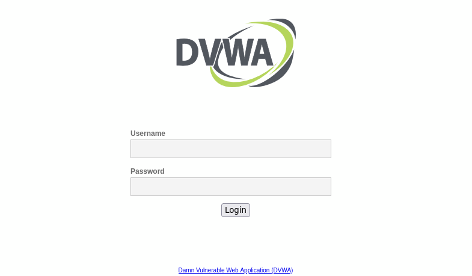

## DVWA (Damn Vulnerable Web App)

**DVWA (Damn Vulnerable Web Application)** es una aplicación web deliberadamente insegura y vulnerable, diseñada con fines educativos y de pruebas de seguridad.  
Fue creada para que desarrolladores, estudiantes y profesionales de la seguridad informática puedan practicar y aprender sobre vulnerabilidades comunes en aplicaciones web.

DVWA proporciona un entorno controlado donde se simulan vulnerabilidades como:

- Inyecciones SQL
- Cross-Site Scripting (XSS)
- Desbordamientos de búfer
- Autenticación débil

Se recomienda usar DVWA únicamente en entornos seguros y aislados (máquina virtual o laboratorio de pruebas).

---

## Instalación

```bash
sudo apt-get install docker.io
docker pull vulnerables/web-dvwa
docker run --rm -it -p 80:80 vulnerables/web-dvwa
```

<p align="center">  </p>

---

## Credenciales por Defecto

- Usuario: **admin**
- Contraseña: **password**

---
