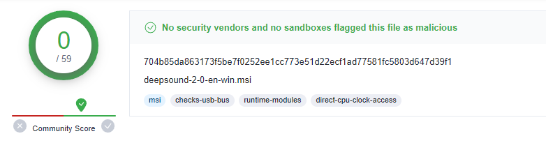
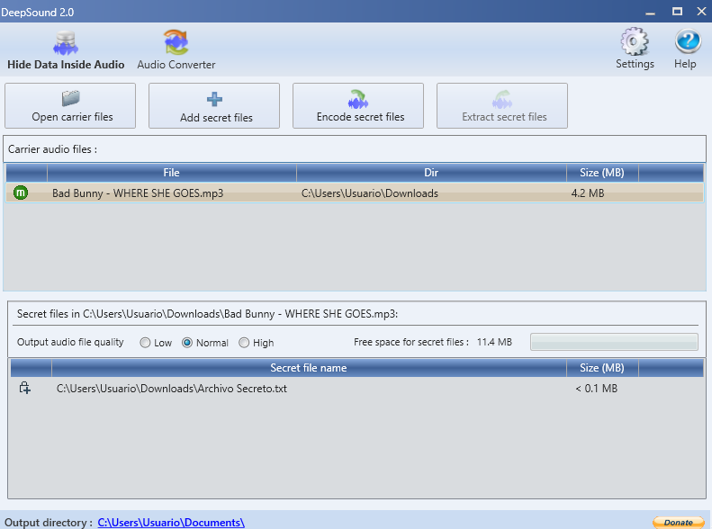

## Deep Sound

**Deep Sound** es un programa que sirve para ocultar datos en un archivo de música MP3.

**Enlace de descarga:** [Deep Sound](https://dw.uptodown.com/dwn/067hpKQbkpNkfzBDSud9VVl1O81nw42l9VGVo_W7-g9QqhxoMKGk9YAakz2xr01ywq-6OHCckqp2Nlta_Oxjv8Q77WJPBMKwW2XmW-Qw2MzpZf3kX8db3ckTjWt7h4Mc/MVrQLZmekDDTaoShSogdjBnEMeSP1WUXhUgPoI0DSWBXccBvi_HhRZbOHD3_IwzJrWQpUxe9L__hM15qI2p_1fjpHW2zz-t3vBxXhwrcgTb7tevnf4vVILwfKbledsje/jqJq0-NFR2COGUNjdJ9ZcFEErAOLeim6p1yh2uoinENDuaPNXzX4n8KOhiB1s_odci6ZRCDVzciM9zh8CV0IEw==/)

---

## Consideraciones

- El archivo que se va a ocultar **no debe pesar más que el archivo de música MP3**.

---

## Imágenes de Referencia

  

  

---
