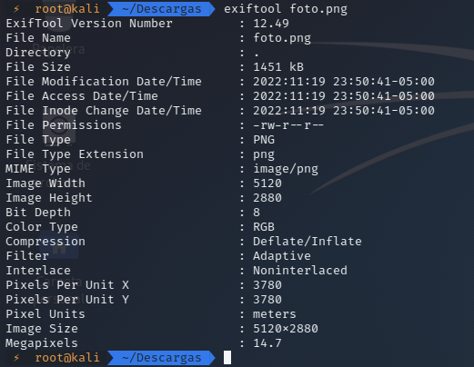

## Análisis de Metadatos con ExifTool

Los metadatos (EXIF) contienen información detallada sobre fotos, vídeos y audios digitales.  
Son útiles para investigaciones, ya que permiten situar eventos, identificar dispositivos y obtener datos relevantes.  
También es importante saber cómo borrarlos para proteger la privacidad.

---

## Instalación

```bash
sudo apt-get install exiftool
```

---

## Uso Básico

Ejecutar ExifTool sobre un archivo:

```bash
exiftool nombre_archivo
```

<p align="center">  </p>

Esto muestra los metadatos de la imagen (dimensiones, dispositivo, etc.).

---

## Añadir o Editar Metadatos

### Ejemplo 1

```bash
exiftool -rights="PRUEBA" -CopyrightNotice="Filter" foto.png
```

<p align="center">  </p>

### Ejemplo 2

```bash
exiftool -description="PRUEBAAA" -CopyrightNotice="PRUEBAAA" Prueba.pdf
```

<p align="center">  </p>

En este caso se selecciona el campo **Description** y se le asigna un nuevo valor.

---

