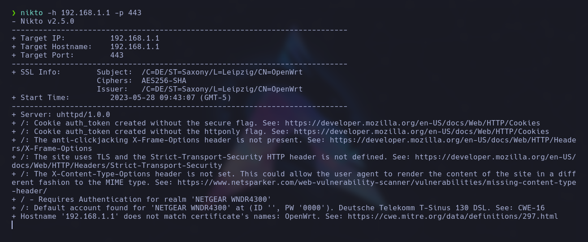

## Análisis de vulnerabilidades con Nikto

**Nikto** es una herramienta de seguridad que analiza servidores web en busca de vulnerabilidades conocidas, configuraciones incorrectas y archivos expuestos.  
Realiza escaneos exhaustivos para detectar fallas comunes en aplicaciones web y problemas en la configuración del servidor.

---

## Instalación

```bash
sudo apt-get install nikto
```

---

## Uso

### Escaneo básico

```bash
nikto -h <Hostname/IP> -p <port>
```

<p align="center">  </p>

### Escaneo de varios puertos

```bash
nikto -h <Hostname/IP> -port <port>,<port>
```

### Tiempo máximo de escaneo

```bash
nikto -h <Hostname/IP> -maxtime <segundos>
```

### Forzar SSL

```bash
nikto -h <Hostname/IP> -ssl
```

### Deshabilitar SSL

```bash
nikto -h <Hostname/IP> -nossl
```

### Evitar mostrar errores 404

```bash
nikto -h <Hostname/IP> -no404
```

### Ignorar códigos de estado

```bash
nikto -h <Hostname/IP> -IgnoreCode <Código>
```

### Cabecera del host

```bash
nikto -h <Hostname/IP> -vhost
```

### Exportar resultados

```bash
nikto -h <Hostname/IP> -output <filename>
```

### Escanear a través de proxy

```bash
nikto -h <Hostname/IP> -userproxy <Proxy IP>
```

### Autenticación

```bash
nikto -h <Hostname/IP> -id <id:pass> or <id:pass:realm>
```

### Actualizar plugins y base de datos

```bash
nikto -update
```

### Comprobar estado de la base de datos

```bash
nikto -h <Hostname/IP> -dbcheck
```

### Fichero de configuración

```bash
nikto -h <Hostname/IP> -config <nikto.conf>
```

### Deshabilitar resolución de nombres

```bash
nikto -h <Hostname/IP> -nolookup
```

### Deshabilitar caché

```bash
nikto -h <Hostname/IP> -nocache
```

### Deshabilitar interacción

```bash
nikto -h <Hostname/IP> -nointeractive
```

---

## Opciones de Evasión

```bash
nikto -h <Hostname/IP> -evasion <Option>
```

1. Codificación aleatoria de URI
2. Auto-referencia de directorio `/./`
3. URL final prematura
4. Anteponer cadena aleatoria larga
5. Parámetro falso
6. TAB como espaciador
7. Cambiar el caso de la URL
8. Separador de directorio de Windows `\`
9. Retorno de carro (0x0d) como espaciador
10. Valor binario (0x0b) como espaciador

---

## Formato de salida

```bash
nikto -h <Hostname/IP> -Format <Option>
```

- **csv**
- **html**
- **msf+** (Metasploit)
- **nbe** (Nessus)
- **txt**
- **xml**

---

## Tuning

```bash
nikto -h <Hostname/IP> -Tuning <Option>
```

- 1: Archivos interesantes
- 2: Configuración incorrecta
- 3: Divulgación de información
- 4: Inyección (XSS / Script / HTML)
- 5: Recuperación remota de archivos (internal web root)
- 6: Denegación de servicio
- 7: Recuperación remota de archivos (todo el servidor)
- 8: Ejecución de comandos – Shell remoto
- 9: Inyección SQL
- 0: Carga de archivos
- a: Bypass de autenticación
- b: Identificación de software
- c: Inclusión de fuente remota
- x: Opción inversa

---

## Mutate

```bash
nikto -h <Hostname/IP> -mutate <Option>
```

1. Testear todos los ficheros en el directorio raíz
2. Adivinar nombres de archivos con contraseña
3. Enumerar usuarios vía Apache
4. Enumerar usuarios vía CGIWrap
5. Fuerza bruta de subdominios
6. Adivinar nombres de directorio desde archivo

---

