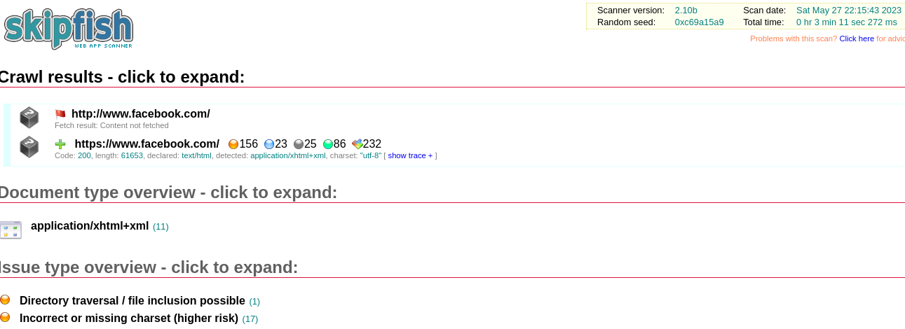

## Reconocimiento con Skipfish

**Skipfish** es una herramienta activa de reconocimiento de seguridad de aplicaciones web.  
Prepara un mapa interactivo del sitio de destino mediante rastreo recursivo y detección basada en diccionario.  
El informe final generado sirve como base para la evaluación profesional de la seguridad de aplicaciones web.

---

## Instalación

```bash
sudo apt-get install skipfish
```

---

## Uso

### Comando básico

```bash
skipfish -o test http://www.facebook.com
```

### Opciones principales

- `-X` → excluir URLs que contengan cierto string (ej. logout)
- `-K` → no realizar fuzzing en parámetros especificados
- `-D` → rastrear otro dominio a través de sitios
- `-l` → número máximo de solicitudes por segundo
- `-m` → número máximo de conexiones simultáneas por IP
- `--config` → especificar archivo de configuración

### Ejemplo

```bash
skipfish -o test2 http://172.16.10.133/dvwa/
```

Salida típica:

- Estadísticas de escaneo (tiempo, solicitudes HTTP, fallos, enlaces externos, etc.)
- Estadísticas de base de datos (pivots, ataques, issues encontrados)
- Informe final guardado en carpeta de salida (`index.html`)

<p align="center">  </p>

---
