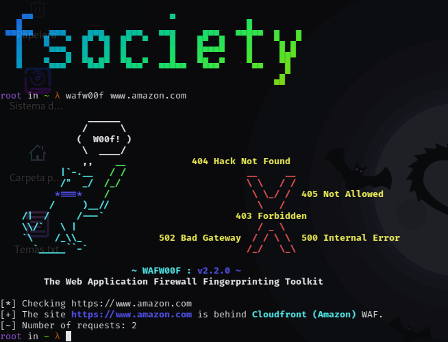
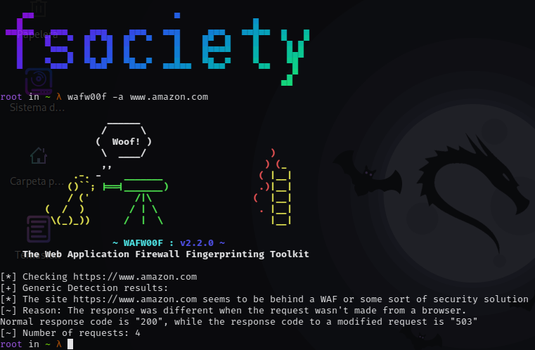
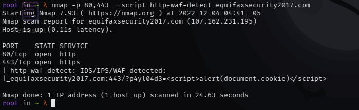

## Escaneo de firewall web con Wafw00f

**Wafw00f** es una herramienta que permite identificar la existencia de un firewall de aplicaciones web (WAF) entre los clientes y el sitio web.  
Envía peticiones HTTP normales y analiza las respuestas para detectar diversas soluciones WAF.

---

## Instalación

```bash
apt-get install wafw00f
```

---

## Uso

### Escaneo básico

```bash
wafw00f www.amazon.com
```

<p align="center">  </p>

Resultado: detección de firewall **Cloudfront**.

### Escaneo avanzado

```bash
wafw00f -a www.amazon.com
```

<p align="center">  </p>

### Integración con Nmap

```bash
nmap -p 80,443 --script=http-waf-detect equifaxsecurity2017.com
```

<p align="center">  </p>

---

