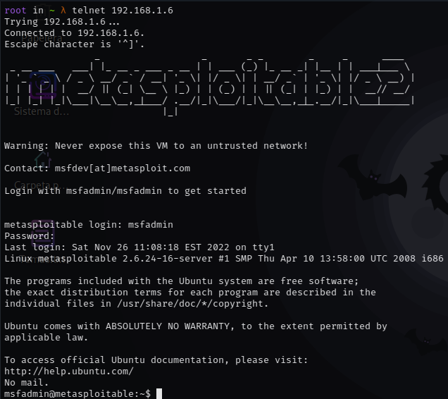
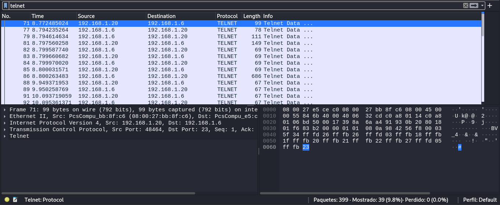
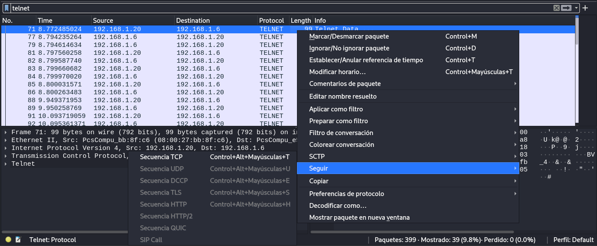
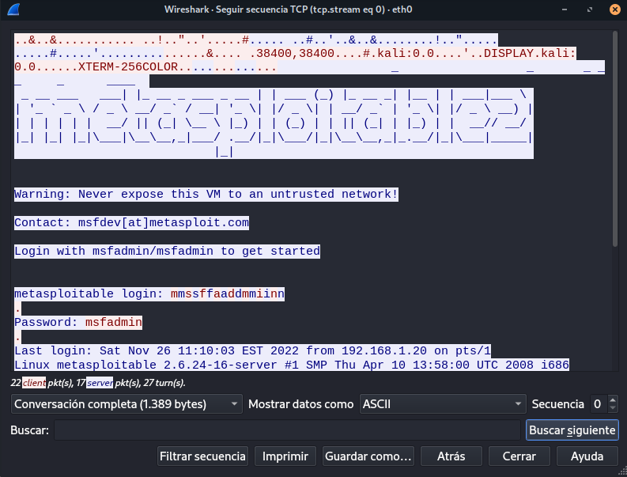

## Obtención de Contraseña con Wireshark

### Conexión vía Telnet

Primero usamos **telnet** para conectarnos a la máquina remota:

```bash
telnet 192.168.1.6
```

<p align="center">  </p>

El usuario y contraseña por defecto es **msfadmin**.

---

### Captura de Tráfico

Una vez conectados, volvemos a **Wireshark** y observamos todo el tráfico interceptado.  
Luego buscamos el protocolo **telnet**.

<p align="center">  </p>

---

### Seguimiento de Secuencia TCP

Seleccionamos la opción **Follow → TCP Stream**.

<p align="center">  </p>

Esto nos permitirá obtener las credenciales del inicio de sesión con telnet.

<p align="center">  </p>

---

### Nota Importante

Este mismo procedimiento puede aplicarse también a protocolos inseguros como **HTTP**.

---
