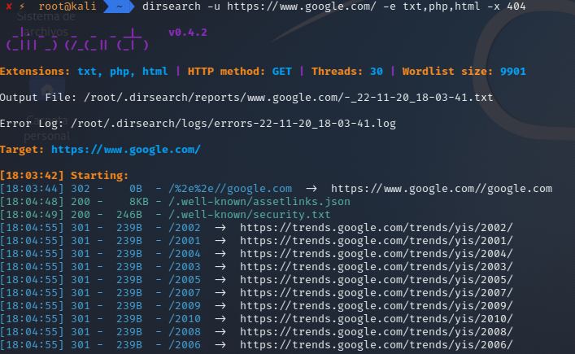

## Escaneo de directorios web con dirsearch

**Dirsearch** es un escáner de directorios para aplicaciones web (diseñado en Python), que ayuda a un hacker ético a buscar información de un sitio web.

---

## Instalación

```bash
sudo apt-get install dirsearch
```

---

## Uso

### Comando básico

```bash
dirsearch -u [url]
```

### Ejemplo

```bash
dirsearch -u https://www.google.com/ -e txt,php,html -x 404
```

**Parámetros principales:**

- `-u`: URL Target
- `-e`: Extensiones
- `-x`: Estados excluidos

<p align="center">  </p>

---

## Resultados del Escaneo

Una vez finalizado, se generará automáticamente un archivo del escaneo en la carpeta **reports**, archivado y ordenado por **target** y **fecha**.

---