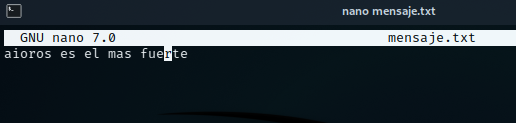

## Ocultar datos en una imagen

**Steghide** es un software de esteganografía de código abierto que permite ocultar un archivo secreto en un archivo de imagen o audio.  
No notarás ningún cambio en la imagen o el archivo de audio, pero el archivo secreto estará dentro.  
Es un software de línea de comando.

---

## Instalación

```bash
sudo apt-get install steghide
```

---

## Uso

### Crear archivo de texto

```bash
nano mensaje.txt
```

<p align="center">  </p>

### Ocultar mensaje en imagen

```bash
steghide embed -ef mensaje.txt -cf aioros.JPG
```

Se pedirá una contraseña para el cifrado.  
De este modo el mensaje queda oculto dentro de la imagen.

### Extraer mensaje oculto

```bash
steghide extract -sf aioros.JPG
```

Se solicitará la contraseña usada anteriormente.  
El mensaje quedará descifrado y accesible.

---